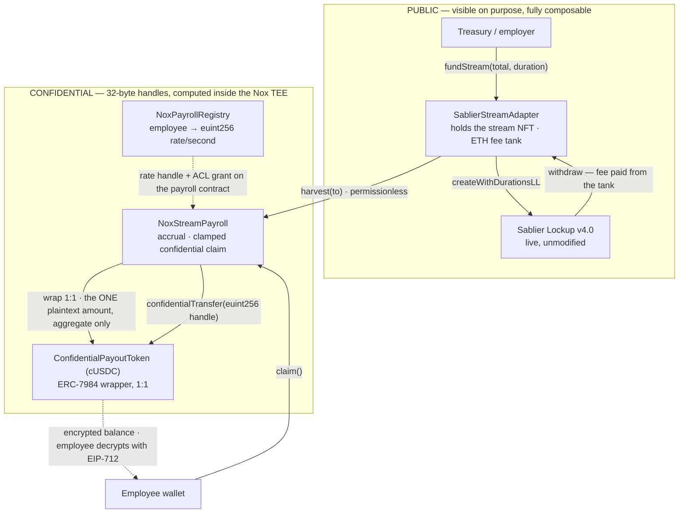

# NoxStream — confidential payroll streaming on iExec Nox

Token streaming is excellent payroll infrastructure with one fatal flaw: **every
salary is public**. Anyone can read what each employee earns, when they claim, and
reconstruct a company's entire compensation band from its stream list. NoxStream
fixes that **without forking the streaming protocol** — the treasury opens one
ordinary, fully auditable Sablier stream, and the per-employee breakdown moves into
iExec Nox as `euint256` handles. Sablier is never modified and never even learns
NoxStream exists; everything that composes with it keeps working.

One public stream in. N encrypted salaries out.

**▶ Live app: https://pranay123-stack.github.io/noxstream/** — the roster is readable
with no wallet at all, and every confidential value shows the 32-byte handle the chain
stores next to whatever a real `decrypt()` returns for the account you connect. Some
rows resolve to a salary; most refuse. It reads the live contracts listed below;
nothing is simulated. A browser wallet (MetaMask or similar) is all you need.

---

## Status

| | |
|---|---|
| Unit tier (`test/unit/*`) | **29 passing** — `payroll.test.ts` (19) against a real Nox stack in Docker, `leak-scanner.test.ts` (10) offline |
| Sablier fork tier | **5 passing** against real, unmodified Sablier Lockup v4.0 bytecode on a Sepolia fork |
| `npm run typecheck` / `npm run compile` | clean across all 3 workspaces; solc 0.8.35, optimizer + viaIR |
| Sepolia deployment | **LIVE** — 5 contracts, see [Live addresses](#live-addresses) |
| Hosted UI | **LIVE** — [pranay123-stack.github.io/noxstream](https://pranay123-stack.github.io/noxstream/), deployed from `main` by [pages.yml](.github/workflows/pages.yml) |
| Live Sepolia e2e (`test/integration/e2e-sepolia.test.ts`) | **8 passing** against the live deployment — real Sablier stream, real confidential claim, leak proof clean |

Nothing in this README reports a result that was not observed. Where something has
not happened yet, it says so.

---

## Architecture



The claim path, precisely — all of it on ciphertext, no step able to `revert` on an
encrypted condition:

```solidity
(ebool mulOk, euint256 owed) = Nox.safeMul(rate, Nox.toEuint256(elapsed));
(ebool solvent, euint256 entitlement) = Nox.safeSub(accrued, claimed);
entitlement = Nox.select(solvent, entitlement, Nox.toEuint256(0));
ebool funded  = Nox.le(entitlement, vaultBalance);
euint256 pay  = Nox.select(funded, entitlement, vaultBalance);   // clamp, never revert
```

A `revert` on "insufficient entitlement" would be a public side channel — anyone
could binary-search a salary by watching which claims succeed. So an over-claim
settles silently to the correct amount and is indistinguishable on-chain from a
full-salary claim. Full design notes: [`docs/ARCHITECTURE.md`](docs/ARCHITECTURE.md).

---

## Privacy model, stated honestly

Nox provides **confidentiality, not anonymity**. Overclaiming here would be easy
and wrong.

| Fact | Hidden? | Where that is enforced |
|---|---|---|
| Individual salary rate | **Yes** — `euint256` handle | [`NoxPayrollRegistry.sol`](packages/contracts/contracts/NoxPayrollRegistry.sol) |
| Individual accrued / claimed | **Yes** — handles | [`NoxStreamPayroll.sol`](packages/contracts/contracts/NoxStreamPayroll.sol) |
| Claim amount | **Yes** — never appears, not even in the event | `ConfidentialClaim(address indexed, euint256 indexed, uint64)` |
| ERC-7984 wallet balance | **Yes** — a handle until the employee unwraps | [`ConfidentialPayoutToken.sol`](packages/contracts/contracts/ConfidentialPayoutToken.sol) |
| Aggregate stream size and schedule | No — deliberately public, keeps payroll auditable | `Harvested(uint256 publicAmount, uint64 epoch)` |
| Roster membership (which addresses are employees) | No — public array, disprovable in one `eth_getLogs` | `employeeAt` / `employeeCount` |
| That address X sent a claim tx at time T | No | the chain |

Claim *timing* is **mitigated, not eliminated**: settlement is epoch-batched and
`harvest()` is permissionless, so what an observer sees is one aggregate transfer
per epoch rather than one per salary. Full timing anonymity would need a relayer or
account abstraction. That is future work, not something this repo implies it has.

One further sharp edge, documented rather than hidden: `Nox.toEuint256(x)` mints a
**public** handle, so a revoked employee's zeroed rate is openly readable. It leaks
nothing new — `AllocationRevoked` is a public event anyway — but it is stated
because it is the kind of thing a privacy claim should not gloss over.

---

## Prerequisites

- **Node 22 or newer.** Hard requirement — Hardhat 3 refuses to run on Node 20, and
  a default system `node` is very often older. Check with `node --version`; if it
  is not 22.x, `nvm use 22` (or `export PATH="$HOME/.nvm/versions/node/v22.*/bin:$PATH"`).
- **Docker**, running, for the confidential unit tests. The Nox Hardhat plugin boots
  the Nox offchain stack in containers on demand. Not needed for `compile`,
  `typecheck`, the leak-scanner tests, or the frontend.
- **npm 10+** (ships with Node 22). The repo is an npm-workspaces monorepo.
- A **Sepolia RPC URL** and a **funded Sepolia key** — only for deploying and for
  the live e2e test. Everything else runs with no keys and no funds.

> The root [`.npmrc`](.npmrc) sets `ignore-scripts=true` on purpose: `@sablier/evm-utils`
> ships a postinstall (`cd node_modules/forge-std && ln -sf src/* .`) that fails and
> aborts the whole install. We consume only Sablier's Solidity sources, which need
> no build step, so a plain `npm install` works from a clean clone.

---

## Install and build

```bash
git clone <repo> && cd iExec_WTF_Hackathon_Summer
node --version          # must be >= 22
npm install             # workspaces: shared, contracts, frontend
npm run compile         # solc 0.8.35, optimizer + viaIR
npm run typecheck       # all three workspaces
```

## Test

Three tiers, in increasing order of cost. The first two need no key and no funds.

```bash
npm test          # unit (29) + Sablier fork (5) — the default, and what CI runs
npm run test:unit # test/unit/*.test.ts   — needs Docker
npm run test:fork # test/integration/fork-sablier.test.ts — needs a Sepolia RPC
npm run test:e2e  # LIVE Sepolia — needs a deployment + two funded keys
```

| Tier | File | What it actually proves |
|---|---|---|
| Confidential unit | [`test/unit/payroll.test.ts`](packages/contracts/test/unit/payroll.test.ts) | Real Nox stack in Docker: every encryption, TEE computation and ACL check is genuine. A third party's `decrypt` is **rejected**; the employee's own **succeeds** and returns the exact rate. Accrual is `rate × elapsed` to the second; a raise does not re-price seconds already worked; a revoked employee keeps what they earned; an over-claim clamps instead of reverting. |
| Leak scanner | [`test/unit/leak-scanner.test.ts`](packages/contracts/test/unit/leak-scanner.test.ts) | Tests the leak detector itself, offline, in milliseconds, on every CI push. A scanner with a broken encoder reports "no leak" on a chain that is leaking everything — strictly worse than no test. It must find a salary word-aligned, minimal big-endian, little-endian and as decimal ASCII, and must **not** fire on a genuine Nox handle. |
| Sablier fork | [`test/integration/fork-sablier.test.ts`](packages/contracts/test/integration/fork-sablier.test.ts) | EDR fork of Sepolia loading the **real 24,481-byte Sablier Lockup v4.0 runtime**. Last run created real stream id **167** — exactly `nextStreamId` read from the live chain, so the fork is real state. A **stranger** harvested 1,525,833 base units to the vault while their attempt to redirect the funds to themselves reverted `UnauthorizedDestination`; a dry fee tank reverted `InsufficientFeeTank`, and 1,937,546,420,382,988 wei from that same stranger unblocked it. |
| Live e2e | [`test/integration/e2e-sepolia.test.ts`](packages/contracts/test/integration/e2e-sepolia.test.ts) | **8 passing** against the live Sepolia deployment and the live Nox gateway — the same assertions, no fork, no mock. Run log below. |

### What the leak test proves (and why it is the interesting one)

A test that only proves "the money arrived" proves nothing about confidentiality.
The e2e test is built to **falsify** NoxStream's central claim and fail if it can:

1. Every on-chain salary read must be a 32-byte handle, never the value.
2. Every log topic, every log data blob and every transaction's calldata, across
   every transaction in the flow, is searched for the plaintext in four encodings
   and three widths — word-aligned (32/16/8 byte), minimal big-endian, minimal
   little-endian, decimal ASCII.
3. `eth_getStorageAt` is walked over each contract's sequential slots **and** over
   the `keccak256(abi.encode(employee, slot))` locations Solidity uses for
   `mapping(address => …)`, and searched for the same patterns.
4. A freshly generated third-party key — which by construction holds no ACL grant —
   must **fail** to decrypt the employee's rate, accrual and balance.
5. The employee themselves must **succeed** and get the exact expected number.
   Without this, "nobody could decrypt anything" would satisfy every other
   assertion while making the product useless.
6. The one deliberately public value, `Harvested.publicAmount`, is asserted to be
   genuinely an *aggregate*: it must not equal the individual payment, because with
   a single claimant that would disclose it.

The scanner self-tests (`assertNeedlesAreDetectable`) before any negative result
from it is trusted.

**Observed result — 8 passing against the live Sepolia deployment, 2026-08-01:**

```
1. registers an encrypted allocation on the live registry      27064ms
2. funds ONE public aggregate Sablier stream                    38981ms
3. harvests the unlocked aggregate into the confidential vault 131451ms
4. the employee claims — confidentially                         35706ms
5. PROOF: no plaintext salary in any event, topic or calldata    1341ms
6. PROOF: no plaintext salary in contract storage                4059ms
7. PROOF: a third party cannot decrypt the employee's salary     3213ms
8. PROOF: the employee CAN decrypt their own, and it is right    5981ms
```

with, from the run log:

- real Sablier **stream id 167** opened on live Sepolia
- `Harvested(publicAmount=18333333)` — the aggregate, public by design
- the employee **paid 1,488,312 base units confidentially** (accrual window 204s × 2953/s)
- **264 hex fields across 5 transactions: clean**
- **144 storage words across 3 contracts: clean**
- outsider `0xd655E35A…` refused on all three handles:
  `Handle (0x0000aa36a72301375008…) does not exist or user … does not have access`
- employee decrypted `rate=2953/s`, `cUSDC balance=1488312` — matching exactly

Note the scanner honestly narrows itself: for the small values (`rate = 2953`,
`paid = 1488312`) it reports *"unpadded forms omitted: too short to distinguish from
ciphertext"*. A 2-byte needle would match random ciphertext constantly, so those
encodings are dropped rather than allowed to produce a meaningless pass. The
`monthly = 7654321000` needle is large enough to keep all six.

---

## Deploy

```bash
cp packages/contracts/.env.example packages/contracts/.env
# fill in SEPOLIA_RPC_URL and DEPLOYER_PRIVATE_KEY (needs Sepolia ETH)

npm run deploy:dry     # preflight + plan, broadcasts nothing
npm run deploy         # hardhat run scripts/deploy.ts --network sepolia
```

[`scripts/deploy.ts`](packages/contracts/scripts/deploy.ts) is idempotent (it reuses
an existing record whose contracts still have code), preflights the balance before
spending gas, and writes a `DeploymentRecord` to
`packages/shared/src/deployments/sepolia.json`. The frontend and the e2e test both
read that file, so **no address is hardcoded anywhere downstream**. Deploy order is
fixed by the dependency graph:

```
MockUSDC (or PAYOUT_ASSET_ADDRESS)
  → ConfidentialPayoutToken     ERC-7984 wrapper over the payout asset
  → SablierStreamAdapter        seeded with 0.005 ETH of fee tank in the same tx
  → NoxPayrollRegistry
  → NoxStreamPayroll
  → registry.setPayroll(payroll)     ← not optional; see below
  → payroll.start()
```

`registry.setPayroll` is load-bearing, not a convenience. NoxCompute checks the ACL
against the **calling contract**, and `claim()` evaluates `rate * elapsed` inside
`NoxStreamPayroll` — so the payroll contract itself must hold a grant on every rate
handle. Skip it and `Nox.safeMul` reverts `NotAllowed` deep inside `claim()`,
nowhere near the `setAllocation` that caused it.

### Live addresses

Deployed to **Ethereum Sepolia (11155111)** on 2026-08-01. Every value below is
copied from the machine-generated
[`packages/shared/src/deployments/sepolia.json`](packages/shared/src/deployments/sepolia.json),
which the deploy script wrote — none was typed by hand, and the frontend reads the
same file.

| Contract | Address | Deploy tx |
|---|---|---|
| `NoxPayrollRegistry` | [`0x2c9A0F1A7312629BEc84AF345D1a8679c2D7d5A7`](https://sepolia.etherscan.io/address/0x2c9A0F1A7312629BEc84AF345D1a8679c2D7d5A7) | [`0x837d2a7d…`](https://sepolia.etherscan.io/tx/0x837d2a7d484315c4cbcfac9255b951ab8215eb25e8f0a5b9c7674b2bafb23bb4) |
| `NoxStreamPayroll` | [`0x5e3D251d3C21Be4DF14b0A69298D6DC9f4A974af`](https://sepolia.etherscan.io/address/0x5e3D251d3C21Be4DF14b0A69298D6DC9f4A974af) | [`0x5994a641…`](https://sepolia.etherscan.io/tx/0x5994a641e9f2f349e726fd353cb23cfd79a39db59f68c49a3e4d0e3d878746a3) |
| `ConfidentialPayoutToken` (cUSDC) | [`0x15bD3F2b7155f669eeFEB8D40EcA4D449922Ed65`](https://sepolia.etherscan.io/address/0x15bD3F2b7155f669eeFEB8D40EcA4D449922Ed65) | [`0x0eecc749…`](https://sepolia.etherscan.io/tx/0x0eecc749b3c143acf5408774bda4d73aea1bc20f0b97ea543f016fbe1228eb76) |
| `SablierStreamAdapter` | [`0x3487141A7A445340a04D8c744cb7d9BD5346C40b`](https://sepolia.etherscan.io/address/0x3487141A7A445340a04D8c744cb7d9BD5346C40b) | [`0xc664d8db…`](https://sepolia.etherscan.io/tx/0xc664d8db663e4f6d371a7e407c4ddbcfd0b0fa9c9bc36a6009de258dd0816ba3) |
| Payout asset (MockUSDC, 6 dp) | [`0x14d62dCf1F6568Db8639b8366592489369aF16B9`](https://sepolia.etherscan.io/address/0x14d62dCf1F6568Db8639b8366592489369aF16B9) | [`0x1b22d0ef…`](https://sepolia.etherscan.io/tx/0x1b22d0ef90b36548bb7c5903df38ecf5279fbced004126e6b0bf58897f6ab2e7) |

Wiring transactions:
[`registry.setPayroll`](https://sepolia.etherscan.io/tx/0x6f9ce082bb6aee5d8b149063693aeaca3b6cc56e544025a498e5949b0113358a) ·
[`payroll.start`](https://sepolia.etherscan.io/tx/0xeb27a70203f503cfb07dcb73e420e99461d0469a717dfddafda86c2af3336ef7)

> **Why the payout asset is MockUSDC.** There is no freely mintable canonical USDC on
> Sepolia. MockUSDC is a faucet token with USDC's 6 decimals; every transfer, stream,
> wrap, claim and ACL check around it is real. Only the issuer is a faucet instead of
> Circle. Pass `PAYOUT_ASSET_ADDRESS` to deploy against any real ERC-20 instead —
> nothing in the contracts assumes the mock.

### Verify it yourself

Nothing below requires trusting this README. Each step reads live chain state.

**1. The contracts exist and are ours.** Open any address above on Etherscan, or:

```bash
cast code 0x5e3D251d3C21Be4DF14b0A69298D6DC9f4A974af --rpc-url https://ethereum-sepolia-rpc.publicnode.com
```

**2. The registry stores handles, not salaries.** Read an employee's rate straight
from the chain — you get a 32-byte pointer, and no amount of RPC access turns it
into a number:

```bash
cast call 0x2c9A0F1A7312629BEc84AF345D1a8679c2D7d5A7 \
  "employeeCount()(uint256)" \
  --rpc-url https://ethereum-sepolia-rpc.publicnode.com
# 3

cast call 0x2c9A0F1A7312629BEc84AF345D1a8679c2D7d5A7 \
  "ratePerSecondOf(address)(bytes32)" 0x706480A5937BC0016397DcC92588c22D3cf69Fe5 \
  --rpc-url https://ethereum-sepolia-rpc.publicnode.com
# 0x0000aa36a723013750084c48c56a85eaea33b121a75f15cef7677daa97dc1c9f
```

The exact bytes change every time the employer rewrites that allocation — the point is
that they are always *bytes*. Byte 0 is the version, bytes 1–4 the chain id, byte 5 the
Solidity type, byte 6 whether it was a fresh encrypted input or computed in the TEE.
That is the entire public surface; the remaining 25 bytes are an opaque digest.

**3. The stream is a normal, unmodified Sablier stream.** Stream 167 on the live
Sablier Lockup — NoxStream never touched the protocol:

```bash
cast call 0xe61cb9153356419bdaD0A8767c059f92d221a3C4 \
  "getRecipient(uint256)(address)" 167 \
  --rpc-url https://ethereum-sepolia-rpc.publicnode.com
```

**4. Reproduce the whole thing.** Requires Node 22, Docker, and two funded Sepolia
keys in `packages/contracts/.env`:

```bash
npm install
npm test          # 29 unit (real Nox stack in Docker) + 5 Sablier fork
npm run test:e2e  # the 8-test leak proof, against the live addresses above
npm run dev       # the frontend, reading the live deployment above
```

> **RPC note.** Use `https://ethereum-sepolia-rpc.publicnode.com` for
> `SEPOLIA_RPC_URL`. The leak test issues hundreds of `eth_getStorageAt` and log
> queries in a burst and will be throttled off a rate-limited endpoint — which
> surfaces confusingly as `Failed to get chain ID` from the Nox SDK. Keep
> `FORK_RPC=https://sepolia.drpc.org` for the forked Sablier test, because
> publicnode returns 403 to Hardhat's EDR forking client. Each endpoint is used
> where it actually works.

**Third-party addresses, verified live on 2026-07-31** (these are not ours and are
already deployed):

| Thing | Address / URL | Evidence |
|---|---|---|
| NoxCompute (Ethereum Sepolia) | [`0x24Ef36Ec5b626D7DCD09a98F3083c2758F0F77bF`](https://sepolia.etherscan.io/address/0x24Ef36Ec5b626D7DCD09a98F3083c2758F0F77bF) | `eth_getCode` returns a real ERC-1967 proxy runtime |
| Nox handle gateway | `https://gateway-testnets.noxprotocol.dev` | HTTP 200 |
| Sablier Lockup v4.0 (Sepolia) | [`0xe61cb9153356419bdaD0A8767c059f92d221a3C4`](https://sepolia.etherscan.io/address/0xe61cb9153356419bdaD0A8767c059f92d221a3C4) | 24,481 bytes of runtime; 167 streams created |

Sablier ships **three** live Lockup releases on Sepolia with mutually incompatible
ABIs. "The Sablier Sepolia address" is ambiguous, and picking the wrong one silently
gives you the wrong ABI — the full provenance chain, including the behavioural
version-discrimination calls, is in [`docs/STREAM_PROTOCOL.md`](docs/STREAM_PROTOCOL.md).

---

## Run the app

```bash
cp packages/frontend/.env.example packages/frontend/.env.local   # every value optional
npm run dev      # vite, http://localhost:5173
```

Before a deployment record exists the app boots into an honest "No deployment record
found" state: it proves it is wired to the live Nox testnet (it pings the real
gateway), lists every path it searched, and disables every write path rather than
rendering a plausible-looking address that would fail later with reverts that look
like our bugs.

When one does exist, the masthead carries a live chip — *"● Live on Ethereum Sepolia ·
registry 0x2c9A…d5A7"* — linking straight to that contract on Etherscan, so the
address the build is actually reading is checkable from the chrome without trusting
this file. (It is hidden below 980px.)

There is no view mode to select. Every confidential value renders **both of its faces
at once** ([`ConfidentialValue.tsx`](packages/frontend/src/components/ConfidentialValue.tsx)),
so the ciphertext and whatever you can read from it are on screen together:

```
[ 0x0000aa…1c9f ]  ->  4,999.96 mUSDC / month     this account holds an ACL grant
[ 0x0000aa…8cf4 ]  ->  Not authorised             NoxCompute's ACL excludes it
[ 0x0000aa…fee9 ]  ->  [ Decrypt ]                nothing has been attempted yet
```

- **The handle is always there, at full strength.** It is genuinely all the chain
  stores. Click any chip to expand all 32 bytes plus the public structure decoded out
  of them — `v0 · chain 11155111 · uint256 · encrypted input`. Public structure,
  private value.
- **What follows the arrow is decided by NoxCompute, not by this app.** An on-chain
  `isViewer(handle, you)` read runs first
  ([`DecryptionProvider.tsx`](packages/frontend/src/nox/DecryptionProvider.tsx)); a
  row the access list excludes never asks for a signature and never reaches the
  gateway. Where the check passes, the number is the result of a real `decrypt()`
  after one gasless EIP-712 signature.
- **Nothing decrypts until you ask** — except your own row, which auto-requests
  because it is yours. The roster carries a *"Decrypt everything I am allowed to see"*
  button precisely so the refusals are visible next to the successes.

That side-by-side contrast is the demonstration: an authorised row and an unauthorised
row, same table, same screen, same instant. It says nothing that the privacy table
above does not already concede — the addresses and the aggregate stay public, and a
refused row proves confidentiality, not anonymity.

The live deployment's roster carries three employees, seeded by
[`scripts/seed-roster.ts`](packages/contracts/scripts/seed-roster.ts). Two of them are
addresses whose private keys were generated during seeding and immediately discarded,
so nobody holds them: those rows are permanently unreadable to every account except
the employer, which holds a deliberate audit grant on every rate
(`Nox.allow(rate, _employer)` in
[`NoxPayrollRegistry.sol`](packages/contracts/contracts/NoxPayrollRegistry.sol) —
an employer that cannot read back what it wrote cannot audit its own payroll).
Connect as the employer and everything opens; connect as an employee and exactly one
row does.

Demo storyboard with the exact click path: [`docs/DEMO.md`](docs/DEMO.md).

---

## Repo layout

```
packages/
  contracts/            Hardhat 3 + Nox plugin + Sablier
    contracts/
      NoxPayrollRegistry.sol        encrypted roster: employee → euint256 rate
      NoxStreamPayroll.sol          accrual, clamped confidential claim, harvest+wrap
      ConfidentialPayoutToken.sol   ERC-7984 cUSDC wrapping the public payout asset
      adapters/SablierStreamAdapter.sol   IStreamAdapter over live Sablier Lockup v4.0
      interfaces/                   the coordination contract between workstreams
      mocks/                        MockUSDC, MockSablierLockup (local chain only)
    scripts/deploy.ts               idempotent deploy → DeploymentRecord JSON
    scripts/seed-roster.ts          adds colleagues whose keys are generated and discarded
    test/unit/                      real Nox stack (Docker) + offline leak-scanner tests
    test/integration/               Sepolia fork (real Sablier) + live Sepolia e2e
    test/utils/leak-scan.ts         the plaintext-leak detector
  shared/                 Nox constants, DeploymentRecord type, deployment records
  frontend/               React 19 + Vite 7 + wagmi + RainbowKit
    src/components/ConfidentialValue.tsx   one value, showing handle and plaintext together
    src/nox/DecryptionProvider.tsx         isViewer → wait → one signature → decrypt
docs/
  ARCHITECTURE.md         the design and the honest privacy model
  STREAM_PROTOCOL.md      Sablier vs Superfluid, decided on on-chain evidence
  NOX_NOTES.md            25 pre-verified findings about the Nox toolchain
  DEMO.md                 4-minute demo storyboard
  SOCIAL.md               draft launch post (unpublished)
feedback.md               feedback to the iExec team, grounded in file paths
```

## Tech stack

| Layer | Choice |
|---|---|
| Confidential compute | iExec Nox — `@iexec-nox/nox-protocol-contracts` 0.2.4, `@iexec-nox/nox-confidential-contracts` 0.2.2, `@iexec-nox/handle` 0.1.0-beta.13, `@iexec-nox/nox-hardhat-plugin` 0.2.0 |
| Streaming | Sablier Lockup **v4.0** (`@sablier/lockup` 4.0.1), live and unmodified |
| Confidential token | ERC-7984 via `ERC20ToERC7984Wrapper` |
| Contracts | Solidity 0.8.35, optimizer + viaIR, OpenZeppelin 5.6 |
| Tooling | Hardhat 3.12 (ESM, Node 22+), viem 2.46, TypeScript 5.8/5.9 |
| Frontend | React 19, Vite 7, wagmi 2, RainbowKit 2, TanStack Query 5 |
| CI | GitHub Actions — build+typecheck+leak-scanner, Nox-in-Docker, Sablier fork; live Sepolia gated behind manual dispatch **and** a funded-key secret |

## Further reading

- [`docs/ARCHITECTURE.md`](docs/ARCHITECTURE.md) — the split, why the payout is a confidential token, the privacy model
- [`docs/STREAM_PROTOCOL.md`](docs/STREAM_PROTOCOL.md) — why Sablier v4.0 and not Superfluid, with raw `eth_call` evidence
- [`docs/NOX_NOTES.md`](docs/NOX_NOTES.md) — 25 verified findings about the Nox toolchain
- [`feedback.md`](feedback.md) — the same findings turned into actionable feedback for iExec
- [`docs/DEMO.md`](docs/DEMO.md) — 4-minute demo script

## Licence

MIT. See the SPDX headers on every Solidity source and the `license` field in each
`package.json`.
